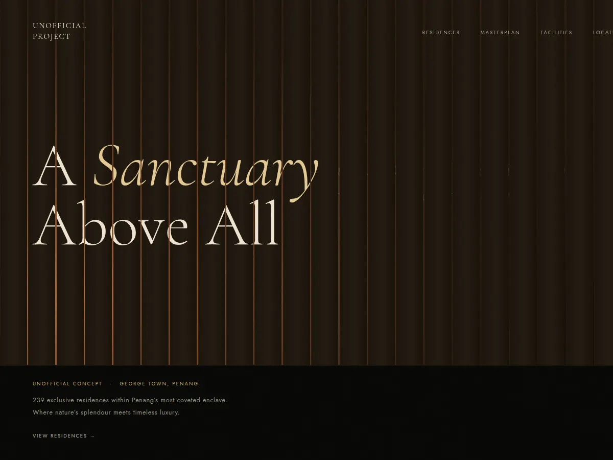

# Unofficial Project

**Live:** https://bravopacino.github.io/unofficial-project/



An unofficial concept site: a design study of a real residential development in George Town, Penang.
**Not commissioned, no client, not affiliated with or endorsed by the developer.**

## What is in it

- **Louvre hero.** The title is printed across a wall of timber louvres. The light in the gaps follows the real sun over George Town at the moment you visit: its colour from the sun's height, its direction from where it stands. The screen holds while the louvres open and the line behind them lights up word by word.
- **Masterplan.** An interactive site plan drawn as SVG. Hovering a zone highlights it in the list, and the other way round.
- **Facilities.** The screen pins and the cards slide sideways until every one has been seen, then the page moves on.
- **Location.** A map that starts close on the site and pulls back to the whole island. Coastline and place names come from OpenStreetMap; distances are straight-line kilometres.

## Stack

- React 19, bundled with Vite.
- GSAP ScrollTrigger for the pinned sections, Lenis for smooth scrolling.
- Three.js for the image distortion effect on the residence cards.

## Run locally

```bash
npm install
npm run dev
npm run build
```

## Credits

- Map data: © OpenStreetMap contributors, ODbL.
- Fonts: Cormorant Garamond and Jost, via Google Fonts.

## Notes

The first version was built with an AI assistant. I then measured it and fixed what the numbers showed.
